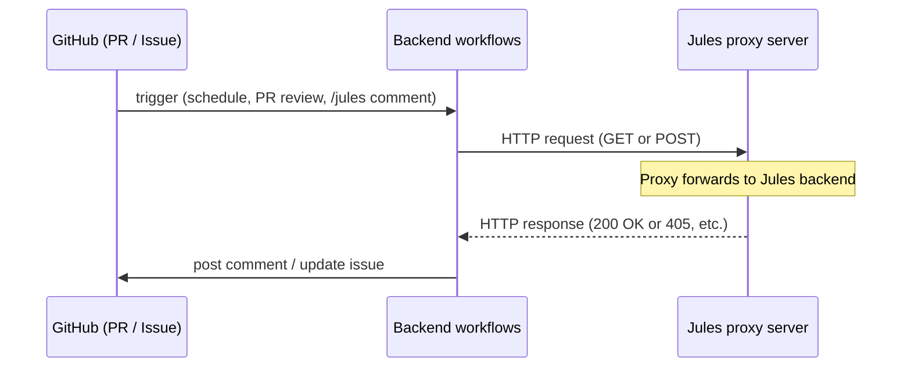

# Jules Proxy Integration and 405 Errors

This document explains how the backend repo talks to the Jules proxy, what causes **405 Method Not Allowed**, and whether to fix the **proxy server** or the **workflows**.

---

## What Happens (Flow)



1. **GitHub** triggers a workflow (e.g. `jules-session-monitor.yml` or `jules-pr-review-forwarder.yml`) on schedule, PR review, or issue comment.
2. The **workflow** reads `JULES_PROXY_URL` and `JULES_PROXY_SECRET`, then calls the **proxy** with `fetch()` (GET or POST).
3. The **proxy** is your server that forwards requests to the real Jules backend. It returns HTTP status codes (200, 405, etc.).
4. If the proxy returns **405**, the workflow logs it and (where applicable) posts a comment with the status and a hint.

---

## What the Workflows Send (Contract)

The workflows assume the proxy implements this API. **No other methods or paths are used.**

| Use case | Method | Path (pattern) | Body |
|----------|--------|----------------|------|
| Get session state | `GET` | `/v1alpha/sessions/{sessionId}` | — |
| Get activities | `GET` | `/v1alpha/sessions/{sessionId}/activities?pageSize=30` | — |
| Approve plan | `POST` | `/v1alpha/sessions/{sessionId}:approvePlan` | — |
| Send message / reply | `POST` | `/v1alpha/sessions/{sessionId}:sendMessage` | `{ "prompt": "..." }` |

**Headers sent by the workflow:**

- `X-Proxy-Secret: <JULES_PROXY_SECRET>`
- `Content-Type: application/json` (only when body is sent)

The workflow does **not** send PUT, PATCH, DELETE, or use different paths. So if the proxy returns **405**, it means the proxy (or something in front of it) is rejecting the **method** or **path** for that request.

---

## What 405 Means

**405 Method Not Allowed** = the server received the request but does **not** allow that HTTP method for that URL.

Typical causes:

1. **Proxy or API gateway** (e.g. nginx, AWS API Gateway) is configured to allow only certain methods (e.g. only POST, or only GET) for the path, and the workflow is sending the other one.
2. **Proxy routing** uses a different path shape (e.g. no `:approvePlan` or `:sendMessage`, or a different prefix than `/v1alpha/`).
3. **CORS / preflight**: sometimes an OPTIONS request is answered with 405; the workflow does not send OPTIONS, but if the proxy is behind a CDN or gateway, it might.

So the problem is almost always on the **proxy side** (configuration or implementation), not in the workflow code, **unless** the proxy API was intentionally changed and the workflow was not updated.

---

## How to Decide: Change Proxy vs Change Workflow

| Situation | Action |
|-----------|--------|
| Proxy is **yours** and you can change it | **Fix the proxy**: ensure it accepts **GET** for session/activities and **POST** for `:approvePlan` and `:sendMessage` on the paths above. Check any reverse proxy (nginx, etc.) for method restrictions. |
| Proxy API **intentionally** changed (e.g. new path or method) | **Fix the workflow**: update `callProxy()` usages in `jules-session-monitor.yml` and `jules-pr-review-forwarder.yml` to use the new method/path. |
| Proxy is **third-party** or you don’t control it | Confirm the provider’s docs for the correct method and path; then either align the proxy config or the workflow to that contract. |

**Quick check:** Call the proxy from `curl` with the same method and path. If `curl` gets 405, the issue is proxy/config, not the workflow.

```bash
# Example: GET session (replace URL and secret)
curl -s -o /dev/null -w "%{http_code}" -H "X-Proxy-Secret: YOUR_SECRET" "https://your-proxy.example/v1alpha/sessions/SOME_SESSION_ID"

# Example: POST sendMessage
curl -s -o /dev/null -w "%{http_code}" -X POST -H "X-Proxy-Secret: YOUR_SECRET" -H "Content-Type: application/json" -d '{"prompt":"Continue"}' "https://your-proxy.example/v1alpha/sessions/SOME_SESSION_ID:sendMessage"
```

If these return 405, the proxy (or gateway in front of it) must be changed to allow GET/POST on those paths.

---

## Workflow-Side Improvements (Already Done)

- **405 hint in logs and comments**: When the proxy returns 405, the workflows now append a short hint:  
  `(405 Method Not Allowed: proxy must allow GET and POST for these paths)`  
  so it’s clear the next step is to check the proxy.
- **Single contract**: All proxy calls go through `callProxy(method, path, body)`; the expected methods and paths are documented above and in comments in the workflow files.

No workflow change will fix 405 if the proxy simply does not allow the method or path. The fix is to align the **proxy server** (or its config) with this contract.

---

## CI/CD verification (correct usage)

All Jules workflows in this repo and across repos (backend, frontend, python-ai, python-recognition, project-info, pipeline-orchestrator, ci-cd, etc.) already call the proxy with **exactly** these paths and methods. No workflow changes are required for the proxy updates below.

| What CI/CD sends | Method | Path |
|------------------|--------|------|
| Session state | GET | `/v1alpha/sessions/{id}` |
| Activities | GET | `/v1alpha/sessions/{id}/activities?pageSize=30` |
| Approve plan | POST | `/v1alpha/sessions/{id}:approvePlan` |
| Send message / reply | POST | `/v1alpha/sessions/{id}:sendMessage` (body: `{ "prompt": "..." }`) |

**Files checked:** `jules-session-monitor.yml`, `jules-pr-review-forwarder.yml` (per repo), and central `agent-processor.yml` in pipeline-orchestrator / ci-cd. All use the same contract.

---

## Proxy implementation checklist

For the proxy server to work with this CI/CD, implement the following (pathname = path without query string; match by pathname for routing):

1. **GET `/v1alpha/sessions/{id}`** — already allowed; optionally switch to pathname-based matching for consistency.
2. **GET `/v1alpha/sessions/{id}/activities`** — allow by adding a GET branch that matches pathname ending with `/activities`. Query `pageSize=30` may be present; route on pathname.
3. **POST `/v1alpha/sessions/{id}:approvePlan`** and **POST `/v1alpha/sessions/{id}:sendMessage`** — allow by adding a POST branch that matches pathname ending with `:approvePlan` or `:sendMessage`, and reuse the same body handling as create-session (JSON body for `:sendMessage` with `prompt`; `:approvePlan` may have empty body).
